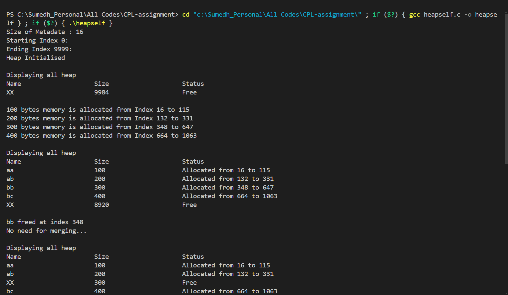

# Simple Heap Memory Manager

## Overview

This project is a simple heap memory manager implemented in C. It simulates a memory allocation system where memory blocks can be allocated, freed, and managed efficiently. The system uses a custom heap with metadata to keep track of allocated and free memory blocks. It includes functionalities to allocate memory, free allocated memory, merge adjacent free memory blocks, and display the current state of the heap.

## Features

1. **Initialize Heap**
   - Initialize the heap with a defined size and set up the initial free memory block.

2. **Allocate Memory**
   - Allocate a specified amount of memory from the heap.
   - Split free blocks if necessary to fit the allocation size.

3. **Free Memory**
   - Free an allocated memory block by name.
   - Merge adjacent free blocks to maintain larger free memory blocks.

4. **Display Heap**
   - Display the current status of the heap, showing allocated and free memory blocks.

5. **Merge Free Blocks**
   - Merge adjacent free memory blocks to reduce fragmentation.

## Implementation Details

### Data Structures

1. **Metadata**
   - A structure to store metadata for each memory block in the heap.
   - Fields: 
     - `size`: Size of the memory block.
     - `allocated`: Boolean indicating if the block is allocated.
     - `name`: Name of the memory block.
     - `next`: Pointer to the next metadata block.

2. **Heap**
   - A char array representing the heap memory.
   - Size defined by `HEAPSIZE`.

### Functions

1. **Initialise(Metadata *heap_ptr)**
   - Initializes the heap with a single large free memory block.
   - Sets up the initial metadata for the heap.

2. **Display()**
   - Displays the current state of the heap.
   - Shows the name, size, and status (allocated/free) of each block.

3. **Allocate(int size_req, char n[N])**
   - Allocates memory of the specified size from the heap.
   - Updates the metadata and splits the block if necessary.

4. **Free(char n[N])**
   - Frees the memory block with the given name.
   - Merges adjacent free blocks after freeing.

5. **Merge()**
   - Merges adjacent free memory blocks.
   - Updates the metadata accordingly.

### Main Function

- The `main()` function initializes the heap and provides a menu-driven interface for users to allocate memory, free memory, and display the heap.
- It takes user inputs to perform the desired operations and handles invalid inputs gracefully.

## Example Output

Here are some example outputs showing the heap operations:

## Conclusion

This project provides a simple yet effective simulation of a heap memory manager. It demonstrates basic memory management techniques, including allocation, deallocation, and defragmentation, using metadata to track memory blocks.
